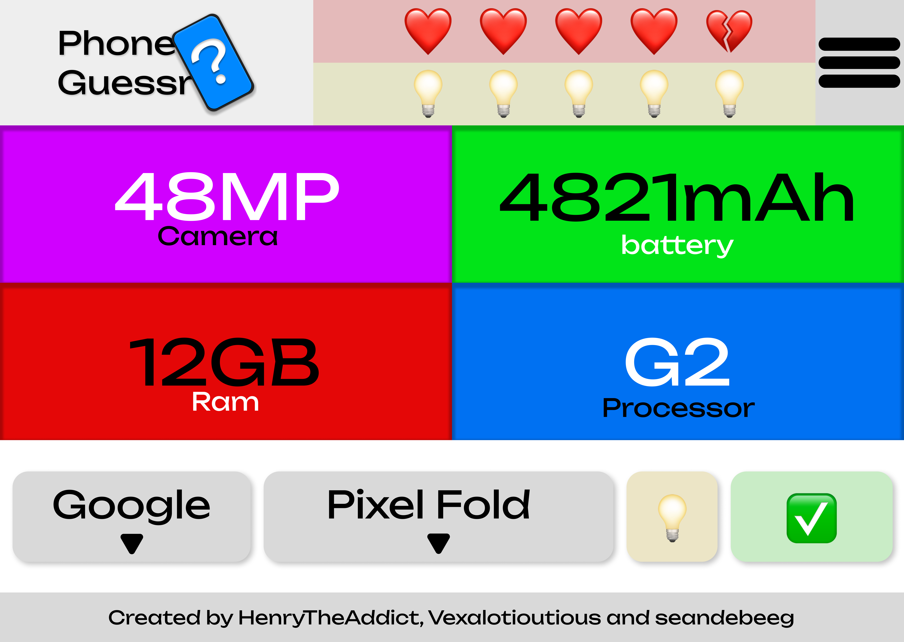

# PhoneGuessr

## Introduction
PhoneGuessr is a fun and engaging game where you have to guess the phone based on its specifications. Test your knowledge of different phone models and see how many you can guess correctly.

## Features
- Multiple choice questions based on phone specs
- Timed challenges to test your speed
- Leaderboard to compete with friends
- Hints to help you guess the phone

## Installation
To install and set up PhoneGuessr, follow these steps:
1. Clone the repository: `git clone https://github.com/HenryTheAddict/PhoneGuessr.git`
2. Navigate to the project directory: `cd PhoneGuessr`
3. Open the `index.html` file in your browser to start playing.

## Usage
1. Open the game in your browser.
2. Read the phone specs displayed on the screen.
3. Choose the correct phone model from the multiple choice options.
4. Try to guess as many phones as possible before the time runs out.

## Contributing
We welcome contributions from the community! If you would like to contribute to PhoneGuessr, please follow these steps:
1. Fork the repository.
2. Create a new branch: `git checkout -b my-feature-branch`
3. Make your changes and commit them: `git commit -m 'Add new feature'`
4. Push to the branch: `git push origin my-feature-branch`
5. Create a pull request.

## License
PhoneGuessr is licensed under the MIT License. See the [LICENSE](LICENSE) file for more information.
